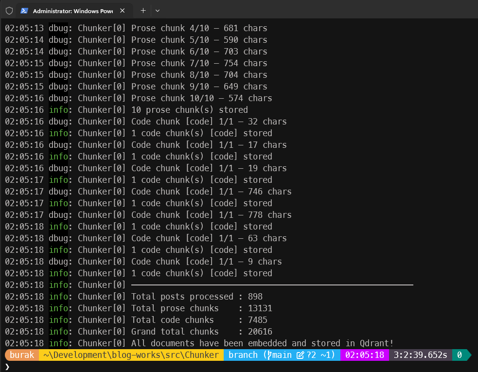
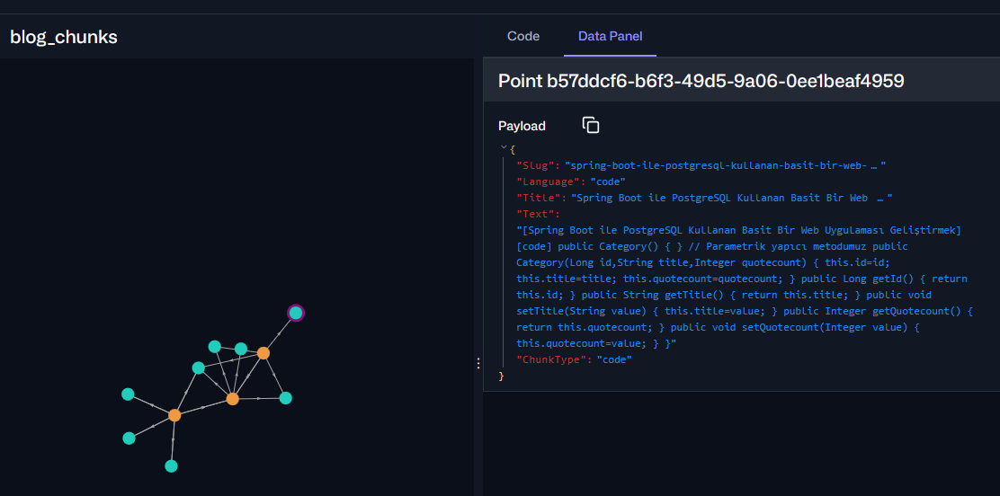

# Güncellemeler

Yapılan çalışmalarla ilgili güncellemelerin yer aldığı belgedir.

## Day 01 - Chunker Embedding Tool

Post içeriklerini yerel text embedding modelinden geçirerek vektör veritabanına atmak için kullanılan .Net tabanlı C# uygulaması.

| Materyal | Detay |
| --- | --- |
| .Net Sürümü | .Net 10 |
| Packages | QDrant.Client, Microsoft.SemanticKernel, Microsoft.SemanticKernel.Connectors.OpenAI, Microsoft.SemanticKernel.Connectors.Qdrant |
| Embedding Modeli | text-embedding-nomic-embed-text-v1.5 |
| Embedding Hosting | LM Studio *(localhost:1234)* |
| Vektör Veritabanı | QDrant |
| Vektör Boyutu | 768 |
| Vektör Hosting | Docker Container *(localhost:6344, gRPC)* |
| Vektör UI | QDrant UI *(localhost:6343/dashboard)* |

### Embedding Stratejisi

Makalelerin text içerikleri yanında en önemli parçaları kod blokları. Makale içeriği HTML formatında olduğundan kod bloklarını ayrıştırmak mümkün ama kolay değil. Kod blokları pre, code gibi elementler içinde yer alıyorlar ama bazen de HTML yorum satırlarıyla ayrılmış şekilde bulunabiliyorlar. Kod bloklarının hangi programlama diline ait olduğunu tespit etmek de ayrı bir mesele. Kod bloklarını yazı içeriğinden ayırmak ve kod bloklarının dillerini tespit etmek için regex tabanlı bir yaklaşım ele alındı.

> Daha kaliteli bir parçalama işlemi için belki de makale içeriklerini HTML formatından markdown formatına dönüştürmek ve ardından markdown formatındaki kod bloklarını ayrıştırmak daha iyi olabilir.

### Çalışma Zamanı

897 makale için text embedding işlemi yaklaşık 3 saat 2 dakika 39 saniye sürdü.

Örnek bir bölümlemeye ait graph çıktısı.

