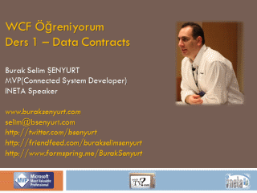

# WCF Öğreniyorum Ders 1–Data Contracts
 Merhaba Arkadaşlar,

Hatırlayacağınız üzere bir süre önce [NedirTv?com](http://www.nedirtv.com) sponsorluğunda WCF Öğreniyorum Webiner serimize başlamıştık. Ders 0 kodlu ilk Webinerimizde SOA (Service Oriented Architecture) kavramına kısaca değinmiş, SOA ile WCF arasındaki ilişkiye bakmış ve ardından WCF (Windows Communication Foundation) geliştirme modelini incelemeye başlamıştık. İlk dersimizde temel olarak aşağıdaki konuları göz önüne aldığımızı ifade edebiliriz.

- Bir WCF Servis geliştirdik  Bunu yaparken hazır Visual Studio proje şablonları yerine standart bir class library şablonu kullandık ve bu anlamda System.ServiceModel.dll assembly’ ının önemini gördük.
- Servisimizi geliştirirken ServiceContract ve OperationContract niteliklerinin (Attributes) ne işe yaradığını öğrendik.
- ServiceContract niteliğinin Name ve Namespace özelliklerini kullandık.
- Servis operasyonlarımızın primitive.net tipleri ile çalışmasına özen gösterdik.
- Geliştirilen WCF Servisinin yayına alınması için bir Console uygulaması yazdık ve çalışma zamanını ayağa kaldırırken ServiceHost tipinin nasıl kullanıldığını gördük.
- Özellikle servisin host edildiği uygulamada Endpoint’ lerin nasıl kullanıldığına şahit olduk ve bu anlamda ilk kez wsHttpBinding bağlayıcı tipi ile karşılaştık.
- Servisimizi tüketecek/kullanacak olan istemciler için gerekli proxy üretiminde komut satırı araçlarından olan svcutil’ den yararlandık.
- Son olarak da servis uygulamamızın çalışmasını test ettik 

Ders 1 kod adlı webinerimizde ise Veri Sözleşmeleri (Data Contracts) kavramına değindik. Bakalım neler anlatmışız.

[Youtube Link](https://www.youtube.com/watch?v=uwo82zNlhdA)

Sunum [WCF 4.0 - Ders 1 - Data Contracts.pptx (314,15 kb)](assets/WCF40Ders1DataContracts.pptx)

[Webiner Kaydı](http://nedirtv.com/video/wcf-ogreniyorum-01-wcf-servis-gelistirmek-ve-kullanmak)

Solution Dosyası Son Hali [WCF Ogreniyorum.rar (81,74 kb)](assets/WCF Ogreniyorum.rar)
