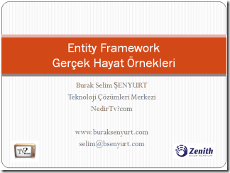

# Entity Framework Gerçek Hayat Örnekleri Bölüm 1
 Merhaba Arkadaşlar,

12 aralık 2011 Pazartesi günü [Nedirtv?com](http://www.nedirtv.com) ve Zenith Bilişim sponsorluğunda gerçekleştirdiğimiz Entity Framework Gerçek Hayat Örnekleri Bölüm 1 isimli webinerimizi aşağıdaki adresten izleyebilir veya isterseniz bilgisayarınıza indirebilirsiniz.

İlk bölümümüzde Entity Framework ve Surrogate Library projelerimizi oluşturup örnek bir iş fonksiyonelliğini diğer bir kütüphane içerisinde ele aldık ve buna ait basit bir Unit Test metodu geliştirdik.

İkinci webinerimizde görüşmek dileğiyle hepinize mutlu günler dilerim.

[Youtube Link](https://www.youtube.com/watch?v=1APRPWnxUi8)

[Entity Framework ile Gerçek Hayat Örnekleri Bölüm 1](http://nedirtv.com/video/entity-framework-ile-gercek-hayat-ornekleri-webineri-1)
{Süre: 56 Dakika 54 Saniye Boyut: 65.7 Mb}
