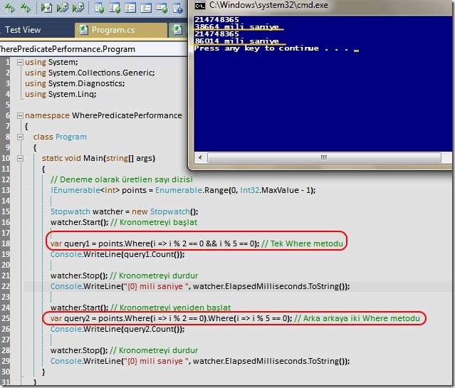

# Tek Fotoluk İpucu - 1 (Tek Where ya da n adet Where)
Merhaba Arkadaşlar,

Bazen bir fotoğraf bin kelimeye bedeldir derler. Bin kelime konusunda şüpheliyim ama bir fotoğrafın anlatım gücü açısından çok önemli katma değerlere sahip olduğuna inanıyorum. İşte size LINQ konusunda performans ipucu verecek bir fotoğraf. Bakalım ben de yarattığı etkiyi siz de yaratacak mı?

