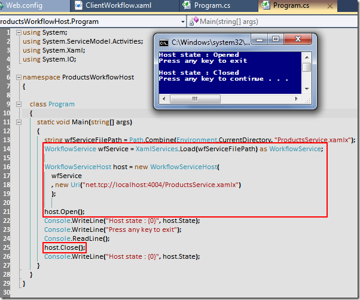

# Tek Fotoluk İpucu - 15(Self Hosted Workflow Service)
Merhaba Arkadaşlar,

Elinizde bir Workflow Service kütüphanesi ve XAMLX uzantılı Workflow Service dosyaları var. Bu dosyalardan yararlanarak kendi Workflow Service Host uygulamanızı yazmak niyetindesiniz. Diyelim ki bu uygulama bir Console projesi olacak. Nasıl yaparsınız? İşte böyle

[ProductsWorkflowHost.rar (38,48 kb)](assets/ProductsWorkflowHost.rar)
