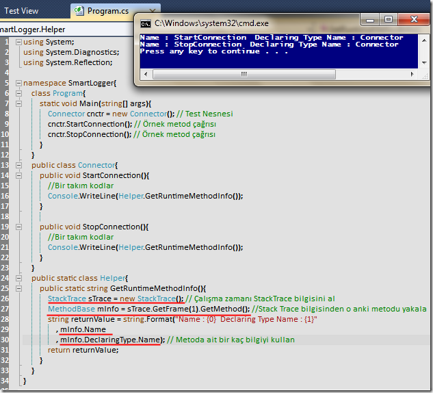

# Tek Fotoluk İpucu - 2 (StackTrace ve Çalışma Zamanı Metod Bilgisi)
Merhaba Arkadaşlar,

Hani olurda çalışma zamanında (Runtime) o anda yürütülmekte olan metodun bilgilerine kolayca ulaşmak istersiniz. Özellikle loglama sistemlerinde. İşte bu durumda StackTrace tipinden yararlanabilirsiniz. Nasıl mı? Aşağıdaki fotoğrafta (ya da Ercan Hocamızın belirttiği üzere Screen Capture'da) görüldüğü gibi

### 

### [SmartLogger.rar (21,41 kb)](assets/SmartLogger.rar)
