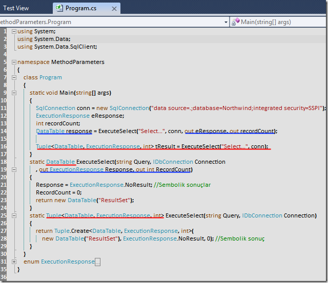

# Tek Fotoluk İpucu - 3 (Tuple)
Merhaba Arkadaşlar,

.Net Framework 4.0 ile gelen Tuple tipini duymayan kalmamıştır. Duymak bir yana en büyük sorun ne zaman ve hangi amaçlar ile kullanılabileceğidir. İşte tek fotoluk ipucu serisinin bu günkü konusu. Örnek bir Tuple kullanımı. Metodlardan birden fazla değeri out veya ref ile döndürmek yerine, Tuple tipiyle döndürebiliriz.

### 

[MethodParameters.rar (21,90 kb)](assets/MethodParameters.rar)
