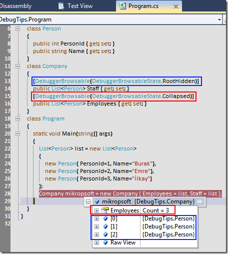

# Tek Fotoluk İpucu - 4 (DebuggerBrowsable Niteliği)
### Merhaba Arkadaşlar,
Attribute diyip geçmeyin. Bazıları çalışma zamanında o kadar çok işe yarıyor ki. Örneğin DebuggerBrowsable niteliği. İşte kullanım şekli. Farkı görebiliyor musunuz?

### 

### [DebugTips.rar (21,35 kb)](assets/DebugTips.rar)
