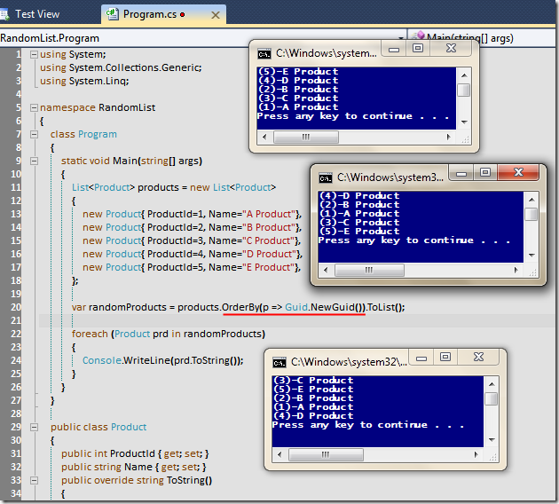

# Tek Fotoluk İpucu - 5 (Rastgele Sıralı Generic List Koleksiyonu)
Merhaba Arkadaşlar,

Elinizde List tipinden bir koleksiyon var ve içerisindeki nesnelerden rastgele sırada yeni bir liste kullanmak istiyorsunuz. Ne yaparsınız? İşte cevabı

[RandomList.rar (22,53 kb)](assets/RandomList.rar)
