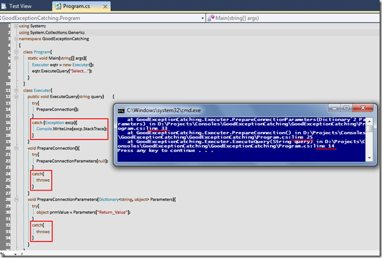

# Tek Fotoluk İpucu - 6 (Fluent Exception Handling)
Merhaba Arkadaşlar,

Bazen iç içe çağrılarda bulunan metod zincirlerinde herhangibir seviyede meydana gelen Exception durumunu, en üst noktada yakalamak isteriz. Bu durumda balon köpüğü misali bir aşağıdan yukarı yükselen bir mekanizmayı kullanabiliriz. Nasıl mı?

(Büyük hali için fotoğrafa tıklayın)

[GoodExceptionCatching.rar (22,12 kb)](assets/GoodExceptionCatching.rar)
