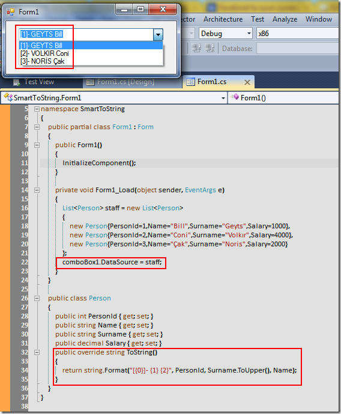

# Tek Fotoluk İpucu - 7 (Windows Liste Bazlı Kontrolleri ve ToString Metodu)
Merhaba Arkadaşlar,

WinForms programcılığında sık rastlanan sorunlardan birisi de, kendi özel tiplerimizi liste bazlı kontrollere bağladığımız durumlarda ortaya çıkmaktadır. Acaba liste bazlı kontrolün içeriğini kendimiz nasıl belirleyebiliriz?

[SmartToString.rar (36,38 kb)](assets/SmartToString.rar)
