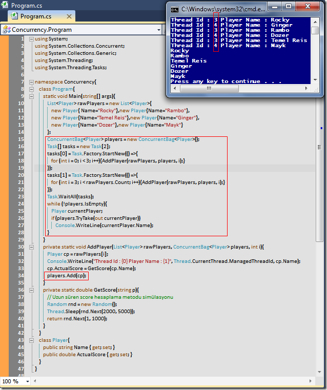

# Tek Fotoluk İpucu - 8 (Parallel ConcurrentBag)
Merhaba Arkadaşlar,

Concurrent Collections deyince aklımıza Thread-Safe koleksiyon tipleri gelmelidir. Söz gelimi bir ConcurrentBag koleksiyonunun basit kullanımına bir örneği aşağıdaki gibi verebiliriz.

[Concurrency.rar (23,94 kb)](assets/Concurrency.rar)
