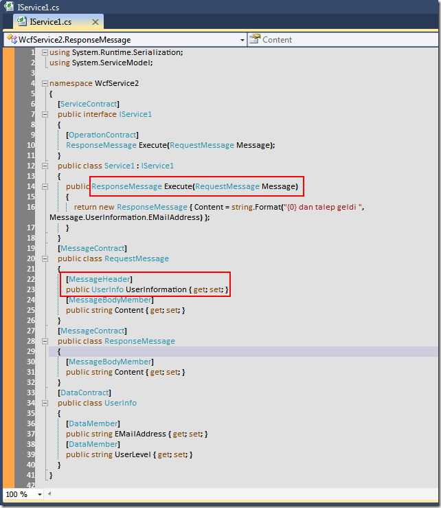
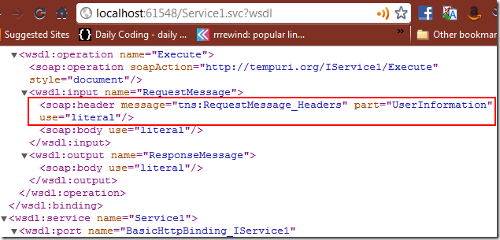

# Tek Fotoluk İpucu – 10 (MessageContract yardımıyla SoapHeader' a Bilgi Eklemek)
Merhaba Arkadaşlar,

Bu kez de WCF ile ilişkili bir fotoğraf paylaşalım istedim. Aslına bakarsanız iki fotoğrafçık oldu ama idare edin artık. Varsayalım ki SOAP paketlerinizin Header kısmında kendi tanımladığınız tip içeriklerinin yer almasını istiyorsunuz. İşte bunun için aşağıdaki fotoğrafta görülen yolu izleyebilirsiniz

[WcfService2.rar (16,58 kb)](assets/WcfService2.rar)
