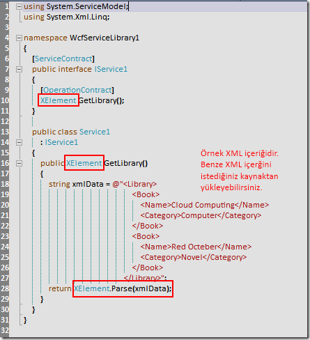

# Tek Fotoluk İpucu – 11 (Ham XML ve XElement)
Merhaba Arkadaşlar,

Hani olurda yazdığınız WCF servislerini.Net istemcilerine açarken XML olarak döndürdüğünüz içeriklari RAW formatlarında sunmak istersiniz. Bu durumda yapacağınız iş çok basittir. İşte örnek

Not: WcfTestClient istemcisine güvenmeyin. XElement tipinin geriye döndürelemeyeceğini söyleyerek örneği test etmenize izin vermez. Bu sizi yanıtlmasın.

[WcfServiceLibrary1.rar (50,01 kb)](assets/WcfServiceLibrary1.rar)
