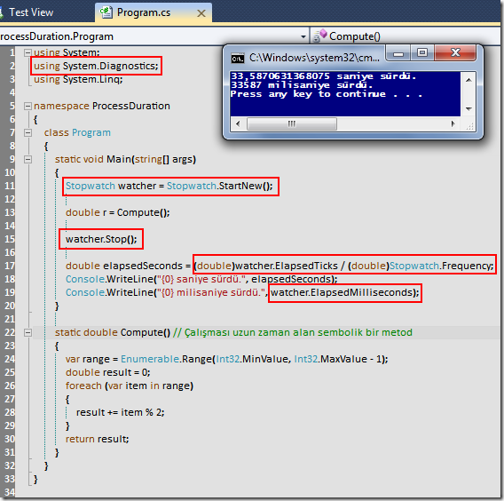

# Tek Fotoluk İpucu – 9 (Stopwatch ile süre ölçümü)
Merhaba Arkadaşlar,

Bazen yazdığımız kod parçalarının işlem sürelerini hesaplama ihtiyacı duyarız. Bu anlamda en çok kullanılan yöntemlerden birisi DateTime ve TimeSpan tiplerini ele almakta iken gerçekte en efektif olanı Stopwatch sınıfını değerlendirmektir. Nasıl mı?

[ProcessDuration.rar (22,01 kb)](assets/ProcessDuration.rar)
