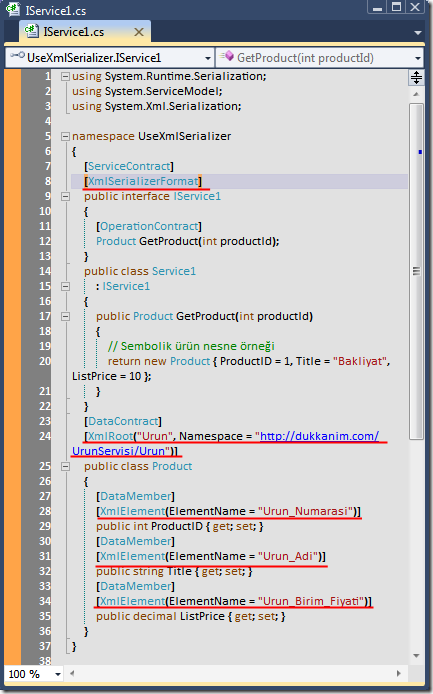

# Tek Fotoluk İpucu-13(XmlSerializer ile Daha Fazla Kontrol)
Merhaba Arkadaşlar,

Bazen SOAP Bazlı WCF servisimizdeki veri türlerinin,.Net tabanlı olmayan platformlarda yer alan istemci veya servislerle daha kolay anlaşabilmesini sağlamak isteyebiliriz. Özellikle bu noktada XmlSerializer işimizi kolaylaştırabilir. Nasıl mı?

[UseXmlSerializer.rar (18,30 kb)](assets/UseXmlSerializer.rar)
