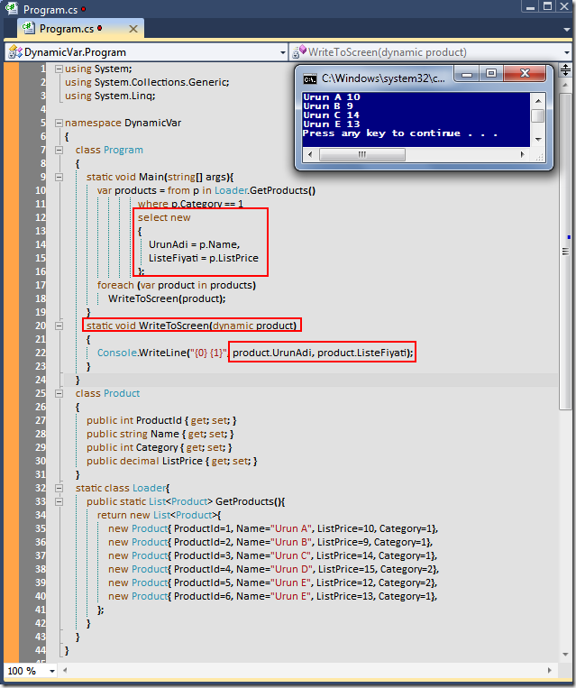

# Tek Fotoluk İpucu-16 (Dynamic Var)
Merhaba Arkadaşlar,

LINQ tarafında isimsiz tipleri (Anonymous Types) oldukça sık kullanmaktayız. Ancak isimsiz tiplerin metodlara parametre olarak geçirilemediğini de biliyoruz

Çünkü bu tipler derleyici tarafından üretiliyorlar. Ama üzülmeyin. Çünkü elimizde 4.0 ile gelen dynamic anahtar kelimesi var. Peki nasıl kullanırız?

[DynamicVar.rar (26,49 kb)](assets/DynamicVar.rar)
