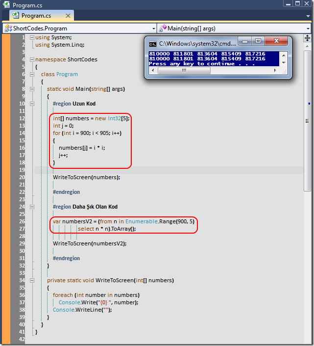

# Tek Fotoluk İpucu-17 (Query ile Daha Şık Kodlama)
Merhaba Arkadaşlar,

LINQ sorgularını sadece sorgulamak için kullandığımızı da nereden çıkartıyorsunuz

Aslında onları kodlarımızı daha şık hale getirmek için de kullanabiliriz? Nasıl mı? İşte küçük bir örnek

[ShortCodes.rar (22,69 kb)](assets/ShortCodes.rar)
