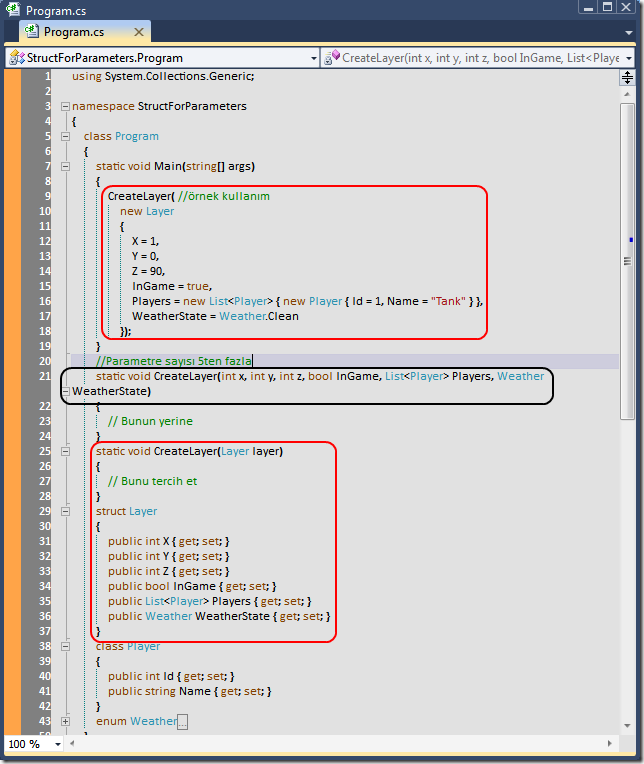

# Tek Fotoluk İpucu-18 (5 Parametreden Fazlası için Struct)
Merhaba Arkadaşlar,

Çok sevgili Juval Löwy der ki: "Bir metod 5den fazla parametre alıyorsa, verileri Struct tipini kullanarak aktarın". Meşhur kod standartlarından birisi olan bu kurala kaçımız ne kadar uyuyoruz acaba? Oysaki kullanımı çok basit. İşte basit bir örnek

[StructForParameters.rar (22,91 kb)](assets/StructForParameters.rar)
