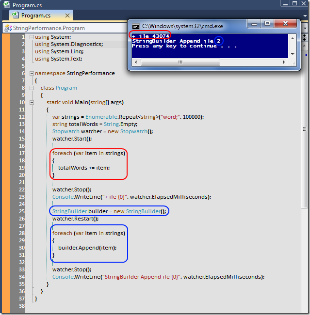

# Tek Fotoluk İpucu-19 (StringBuilder deyip geçme)
Merhaba Arkadaşlar,

String tipleri çok garip tiplerdir. Onları + operatörü ile birleştirmek bazen akıl karı değildir. Çok fazla performans kaybettirir. Bir de uzlaşma yoluna gidebileceğini StringBuilder var. Örneğin

[StringPerformance.rar (22,11 kb)](assets/StringPerformance.rar)
