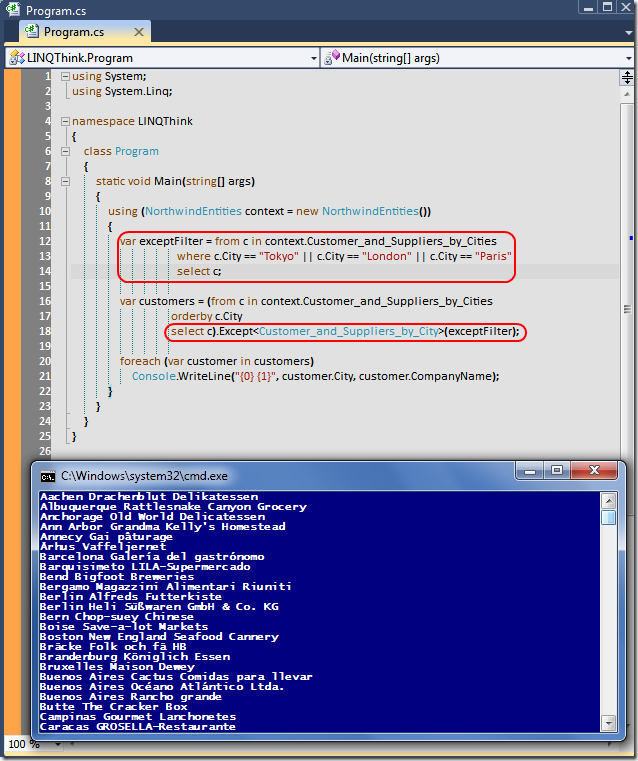

# Tek Fotoluk İpucu-20 (Except Sorgusu)
Merhaba Arkadaşlar,

Hemen hepimiz LINQ sorgularını kullanıyoruz (Tabi aramızda halen.Net 2.0 ve altı ile çalışan zavallılar da yok değil

) Lakin LINQ içerisinde çok enteresan extension method'lar olduğunu da biliyor muyuz? Örneğin, şehir bazındaki müşteri listesini veren bir View'un LINQ sorgusunda, belirli şehirlerin dışında kalanların kümesini almak isteyebiliriz. Aşağıdaki örnekte olduğu gibi

[LINQThink.rar (38,50 kb)](assets/LINQThink.rar)
