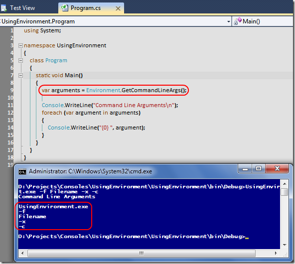

# Tek Fotoluk İpucu-22 (GetCommandLineArgs)
Merhaba Arkadaşlar,

Zaman zaman komut satırından çalışan Console uygulamaları geliştiririz ve bu programlar genellikle komut satırı parametreleri alarak çalışırlar. Çoğunlukla Main metodunun string[] tipinden parametresini kullanırız. Peki Environment tipinin de komut satırı argümanlarını alabilmemiz için bir metod sunduğunu biliyor muydunuz?

Environment tipinde neler var neler zaten

[UsingEnvironment.rar (20,82 kb)](assets/UsingEnvironment.rar)
