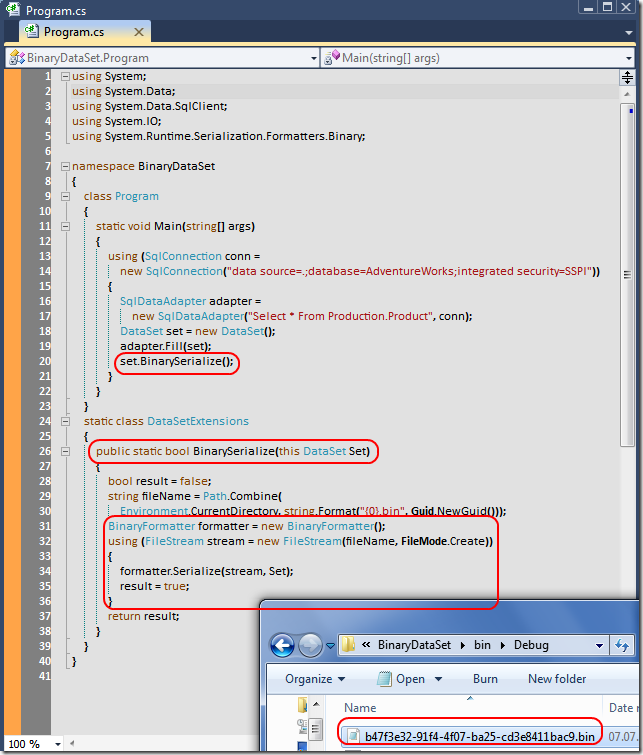

# Tek Fotoluk İpucu-23 (BinaryFormatter, DataSet, Extension Methods)
Merhaba Arkadaşlar,

Bu kez elimde bir DataSet, Binary serileştirme için BinaryFormatter ve tabiki Extension Method kabiliyeti var. Ne yapabiliriz? Belki de bir DataSet'in Binary formatta Serialize, DeSerialize işlemlerini üstlenen genişletme metodlarını yazabiliriz. Ben Serialize kısmını yazdım. Gerisi size kalmış

[BinaryDataSet.rar (49,42 kb)](assets/BinaryDataSet.rar)
