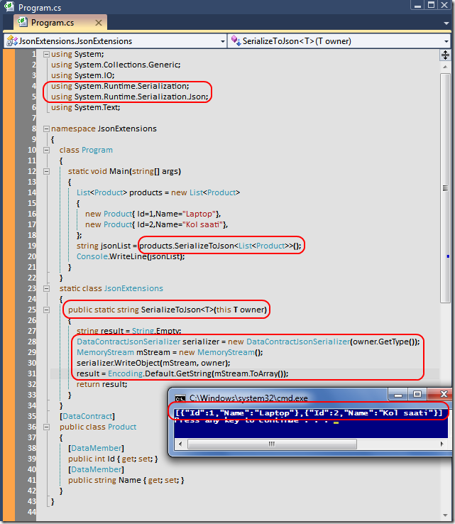

# Tek Fotoluk İpucu-24(DataContractJsonSerializer ve Extension Method)
Merhaba Arkadaşlar,

Extension metodlar çok ama çok işimize yarayabiliyor. Örneğin serileştirilebilir herhangibir tipin Json formatındaki çıktısının string tipinden döndüren bir extension metodu geliştirebilirsiniz. Nasıl mı?

[JsonExtensions.rar (23,64 kb)](assets/JsonExtensions.rar)
