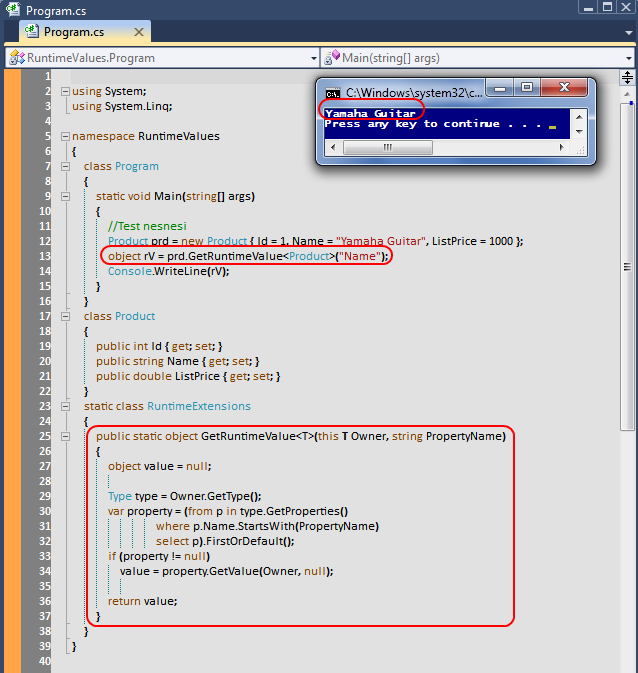

# Tek Fotoluk İpucu-25 (Runtime Value ve Extension Method)
Merhaba Arkadaşlar,

Özellikle Reflection kullandığımız bazı çalışma zamanı senaryolarında, nesnelerin özellik değerlerini elde etmek istediğimiz durumlar da söz konusu olabilir. Çok basit bir senaryo göz önüne alındığında bunun için bir Extension method dahi geliştirebiliriz. Nasıl mı?

[RuntimeValues.rar (23,48 kb)](assets/RuntimeValues.rar)
