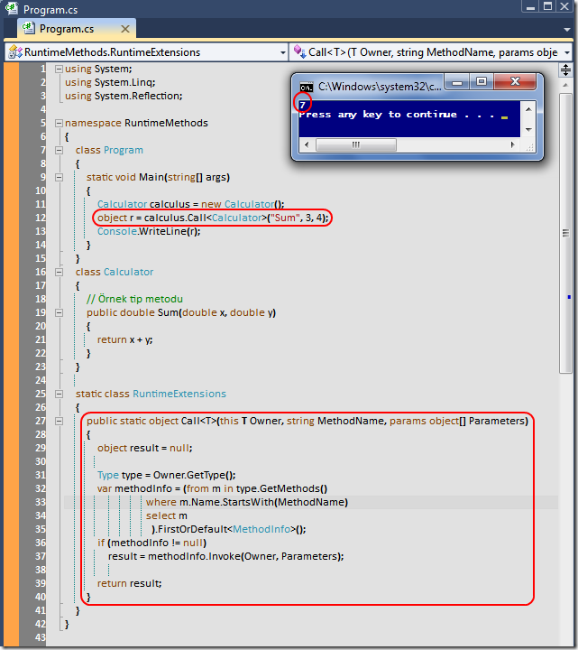

# Tek Fotoluk İpucu-26 (Runtime Method Çağrımı)
Merhaba Arkadaşlar,

Sanırım bir önceki tek fotoluk ipucunda çalışma zamanındaki bir nesne özelliğinin değerinin nasıl alınabileceğini görmüştük. Elbette reflection konulu işlerde bir nesne örneğinin bir metodunun çağırılması da söz konusu olabilir. Nasıl mı?

[RuntimeMethods.rar (24,17 kb)](assets/RuntimeMethods.rar)
