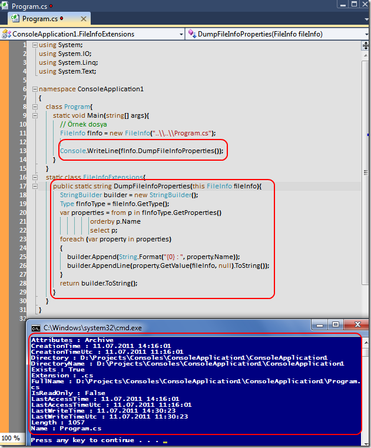

# Tek Fotoluk İpucu-27(FileInfo Bilgisinin Tamamını İndirmek)
Merhaba Arkadaşlar,

FileInfo tipi yardımıyla bir dosyanın pek çok özelliğine erişebiliriz bildiğiniz üzere. Peki tüm bu bilgileri tek bir String içerisinde toplamak ister misiniz? Söz gelimi loglamalarda bu oldukça işe yarayabilir. Hatta bunu bir Extension method olarak da yazabiliriz. Nasıl mı?

[ConsoleApplication1.rar (23,97 kb)](assets/ConsoleApplication1.rar)

[BurakSenyurtVsColorSchema.vssettings (280,59 kb)](assets/BurakSenyurtVsColorSchema.vssettings)
