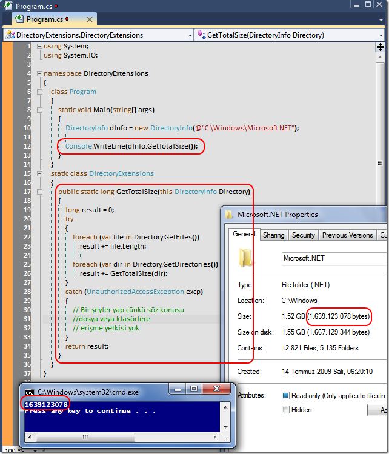

# Tek Fotoluk İpucu-28(Bir Klasörün Yaklaşık Toplam Boyutunu Bulmak)
Merhaba Arkadaşlar,

Bir klasörün tüm içeriğinin toplam boyutunu öğrenmek isteyebiliriz. Bunun için DirectoryInfo tipine bir ExtensionMethod eklersek de güzel olur. Hatta bu metodun alt klasörleri de gezebilmesi için Recursive olarak yazılması da gerekir. Nasıl mı?

Not: Yanlız erişim yetkisi olmayan klasörler söz konusu olduğunda boyut bilgisi eksik çıkacaktır. Bunun çözümünü de size bırakıyorum. Biraz araştırın bakalım 

[DirectoryExtensions.rar (23,28 kb)](assets/DirectoryExtensions.rar)
