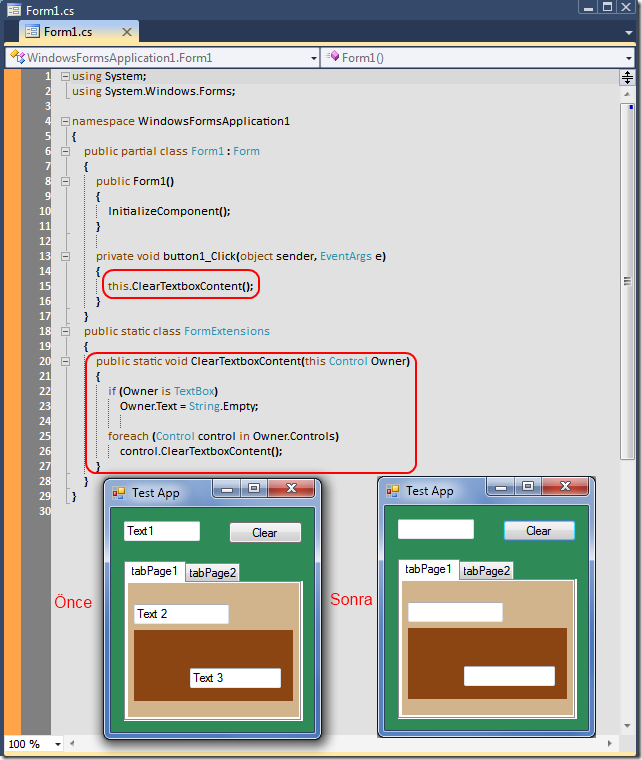

# Tek Fotoluk İpucu-29 (Ne Kadar TextBox Varsa)
Merhaba Arkadaşlar,

Kaliteli kod yazmak için aslında biraz titiz düşünmek gerekir. Söz gelimi bir Windows programlamada bir Container kontrol içerisindeki tüm TextBox'ların içeriğini temizlemek istediğiniz bir durumda nasıl kodlama yaparsınız? İşin içerisine Recursive metod formatını katabilirsiniz. Hatta bunu bir Extension Method haline de getirebilirsiniz. Nasıl mı?

[WindowsFormsApplication1.rar (40,37 kb)](assets/WindowsFormsApplication1.rar)
