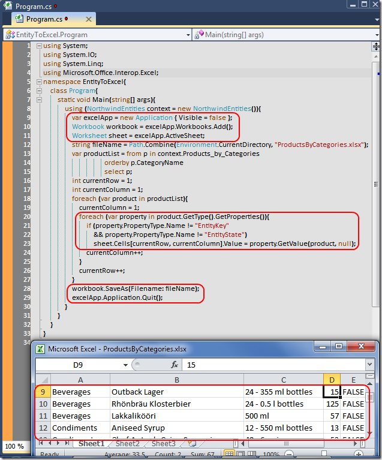

# Tek Fotoluk İpucu-30 (Entity Sorgusundan Excel Dosyasına)
Merhaba Arkadaşlar,

.Net Framework 4.0' ın getirdiği pek çok yenilik sayesinde Office gibi API'leri kullanmamız çok daha fazla kolaylaştı. Örneğin bir Entity sorgusunun sonucunu Excel dosyasına aktarmak için daha basit kodlamalar yapabiliyoruz. Nasıl mı?

[EntityToExcel.rar (57,44 kb)](assets/EntityToExcel.rar)
