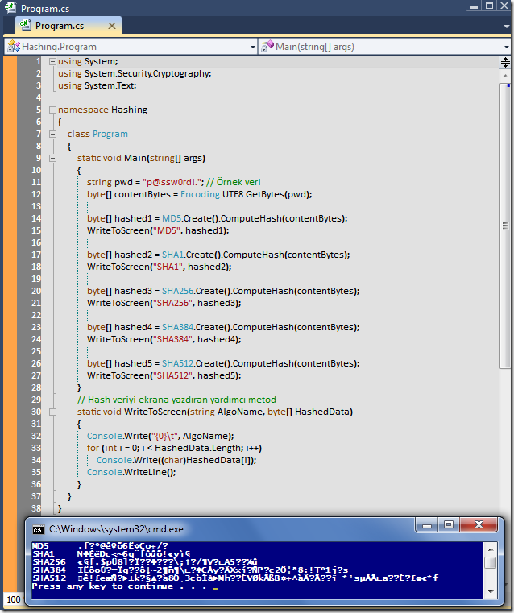

# Tek Fotoluk İpucu-31(Hashing)
Merhaba Arkadaşlar,

Hiç bir zaman kullanıcılarımıza ait şifreleri açık formatta saklamamamız gerekir. En basit anlamda söz konusu verileri Hash'leyerek tutmak en doğrusudur. Bu anlamda.Net tarafında kullanımı son derece basit olan Hash algoritma tipleri mevcuttur. Nasıl kullanıldığını merak ediyor musunuz?

[Hashing.rar (21,76 kb)](assets/Hashing.rar)
