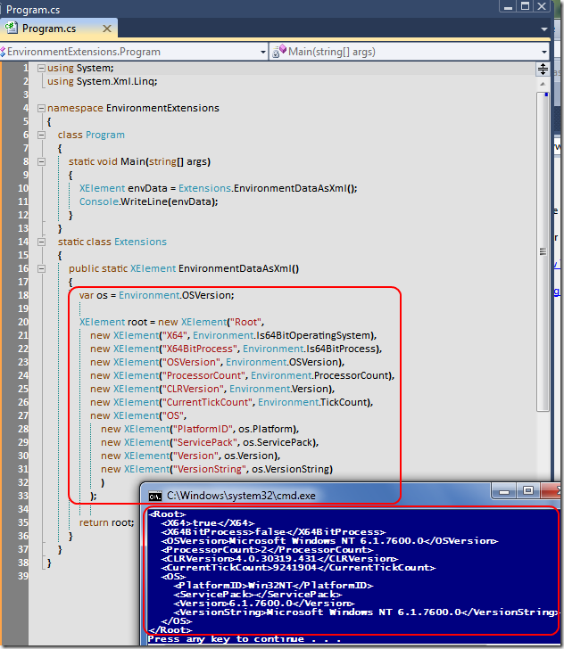

# Tek Fotoluk İpucu-32(Environment Verisini XML Olarak Sunmak)
Merhaba Arkadaşlar,

System.Environment tipi içerisinde son derece yararlı ortam bilgileri bulunmaktadır. Bu bilgileri elde etmek son derece kolaydır. Hatta dilerseniz bunları XML formatında dış dünyaya sunabilirsinizde. Nasıl mı?

[EnvironmentExtensions.rar (22,66 kb)](assets/EnvironmentExtensions.rar)
