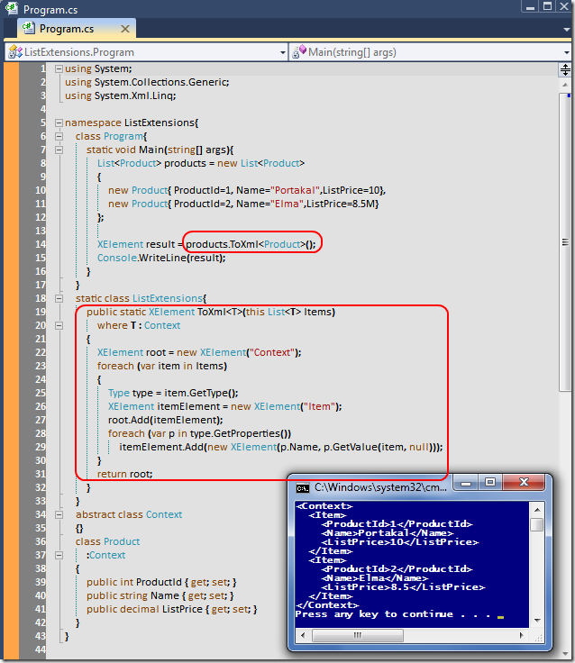

# Tek Fotoluk İpucu-33(Xml Cast)
Merhaba Arkadaşlar,

Varsayalım ki elimizde kendi geliştirdiğimiz tipler ve kullandığımız List koleksiyonları var. Ve olduda bir yerde bu koleksiyonların içeriklerinin XML çıktılarına ihtiyaç duyduk. Basit bir Extension method geliştirebilir miyiz acaba?

[ListExtensions.rar (23,69 kb)](assets/ListExtensions.rar)
