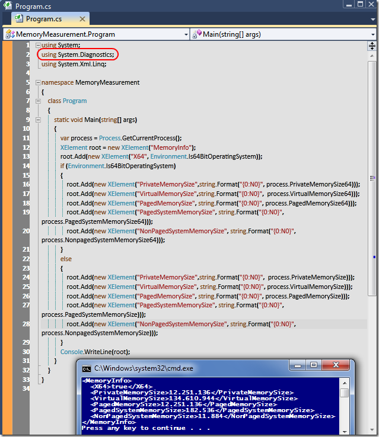

# Tek Fotoluk İpucu-34(Güncel Process için Bellek Bilgileri)
Merhaba Arkadaşlar,

Çalıştırdığımız.Net tabanlı uygulamaların anlık bellek tüketimlerini kod içerisinden ölçümlemek ve hatta loglamak iyi bir fikir olabilir. Hatta bu çıktıyı XML formatında dış dünyaya da sunabiliriz. Basit anlamda aşağıdaki fotoğraf size ipucu verecektir kanaatindeyim.

[MemoryMeasurement.rar (22,15 kb)](assets/MemoryMeasurement.rar)
