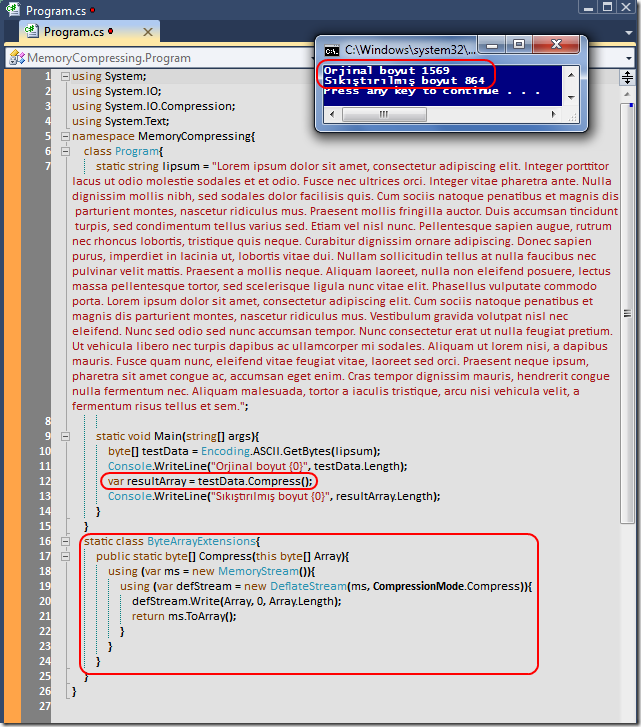

# Tek Fotoluk İpucu-35(DeflateStream ile Sıkıştırmak)
Merhaba Arkadaşlar,

Diyelim ki uygulama içerisinde kullandığınız büyük boyutlu bir byte dizisi var. Aslında bu diziyi bellek üzerinde sıkıştırarak daha az yer tutacak şekilde de kullanma şansınız olabilir. DelfateStream tipi bu anlmada işinize yarayacak Compress ve Decompress metodlarını içermektedir. İşte size örnek bir kullanım. Lorem Ipsum'u byte seviyesinde sıkıştırıyoruz. E decompress kısmı da size kaldı.

[MemoryCompressing.rar (25,22 kb)](assets/MemoryCompressing.rar)
