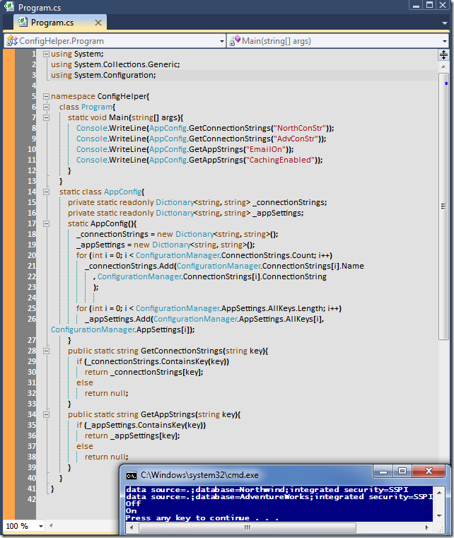

# Tek Fotoluk İpucu-36(Config Dosyasına Kolay Ulaşım)
Merhaba Arkadaşlar,

.Net Framework 2.0 ile birlikte gelen Configuration API'sini hepimiz biliyoruzdur. Bu API sayesinde config dosya içeriklerinin Managed karşılıkları olan tiplere ulaşmamız son derece kolay. Aslına bakarsanız pek çok uygulamada config dosyası içerisinde ConnectionStrings ve AppSettings kısımlarını sıklıkla kullandığımızı görmekteyiz. Bu içeriklere daha efektif ve performanslı erişim için belki bir Wrapper tip işimizi görebilir. Nasıl mı?

[ConfigHelper.rar (24,02 kb)](assets/ConfigHelper.rar)
