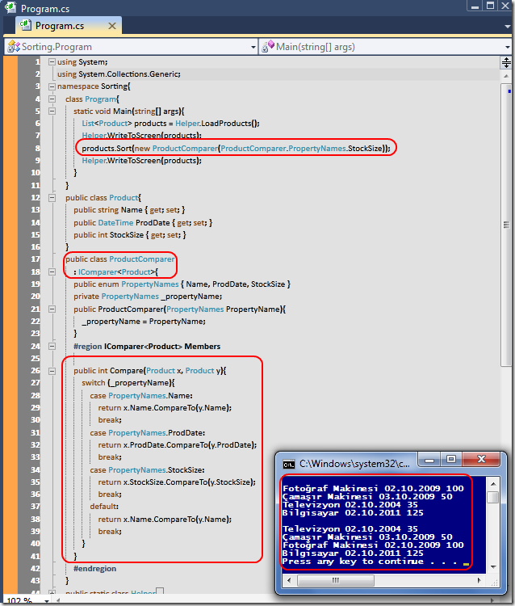

# Tek Fotoluk İpucu-37(Faydalı Interface Tiplerinden IComparer<T>)
Merhaba Arkadaşlar,

.Net içerisinde pek çok faydalı Interface tipi bulunmaktadır. Örneğin kendi tiplerinizin sıralama işlemlerini öğrenebilmesi için kullanabileceğimiz IComparer. Nasıl kullanıldığını merak ediyor musunuz? İşte size basit bir fotoğraf 

[Sorting.rar (24,13 kb)](assets/Sorting.rar)
