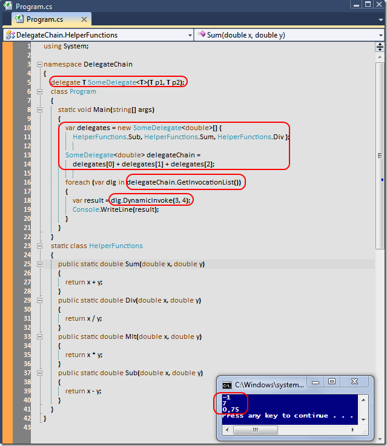

# Tek Fotoluk İpucu-38(Delegate Chain)
Merhaba Arkadaşlar,

Arada sırada temelleri de hatırlamak gerekir değil mi? Söz gelimi bir delegate zincirini nasıl kurar ve aynı parametreler için nasıl çalıştırırsınız? İşte size örnek

[DelegateChain.rar (22,77 kb)](assets/DelegateChain.rar)
