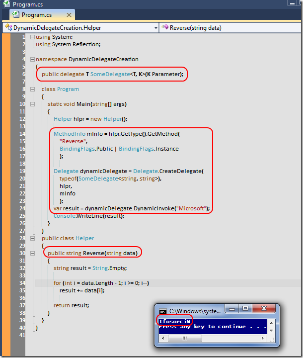

# Tek Fotoluk İpucu-39(Dynamic Delegate Üretmek)
Merhaba Arkadaşlar,

Bazen çalışma zamanına ilişkin yapmamız gereken atraksiyonlar olur. Söz gelimi çalışma zamanında bir delegate tipinin dinamik olarak üretilmesini ve yürütülmesini isteyebiliriz? Peki bu nasıl olacak? İşin içerisine birazcık Reflection katarak tabiki de

[DynamicDelegateCreation.rar (23,25 kb)](assets/DynamicDelegateCreation.rar)
