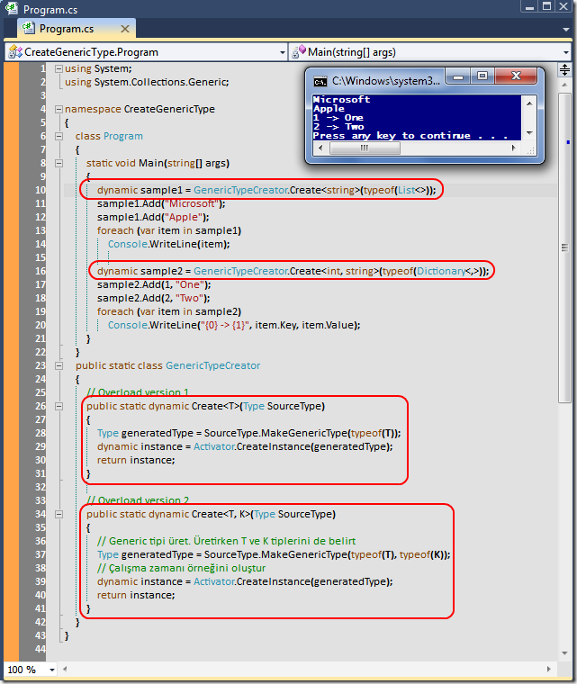

# Tek Fotoluk İpucu-40(Sebze Çorbası)
Merhaba Arkadaşlar,

Hani böyle annemiz zamanında içinde yok yok dedirtecek türden çorbalar yapmıştır. Her çeşit sebzenin konulduğu

Hah işte bu fotoğrafta ona benziyor. İçinde generic mimari var, reflection var, dynamic tip kullanımı var

Olay gayet basit. Çalışma zamanında generic tipleri dinamik olarak üretip kullanmak istediğinizi düşünün. Bunu nasıl sağlarsınız? İşte basit bir örnek

[CreateGenericType.rar (24,98 kb)](assets/CreateGenericType.rar)
