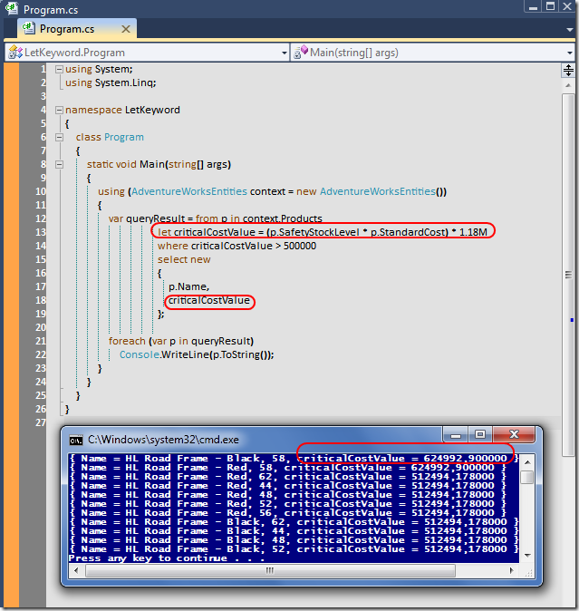

# Tek Fotoluk İpucu-41(Let Keyword)
Merhaba Arkadaşlar,

LINQ sorgularını pek çoğumuz etkin bir şekilde kullanıyoruzdur. Ama belki aralarda atladığımız keyword'ler de vardır. Mesela Let. Çık sık kullanmasakta oldukça işimize yarayan bir anahtar kelimedir. Söz gelimi onu bir ifadeye eşitleyip LINQ sorgusunun hatırlamasını sağlayabilir, koşul olarak değerlendirebilir hatta anonymoust tip içerisine bile dahil edebiliriz. Tipik olarak sorgu içinde bir değişken mantığında ele almış oluruz. Nasıl mı?

[LetKeyword.rar (194,69 kb)](assets/LetKeyword.rar)
