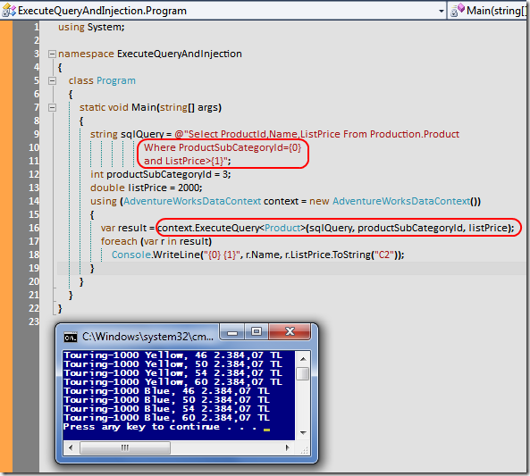

# Tek Fotoluk İpucu-42(ExecuteQuery ile Injection' dan Korunmak)
Merhaba Arkadaşlar,

LINQ to SQL kullandığımız durumlarda bildiğiniz gibi dışarıdan SQL sorgularını da icra ettirebilmekteyiz. Bu amaçla DataContext tipinin ExecuteQuery metodu kullanılmakta. Ancak özellikle SQL Injection saldırılarına karşı dikkatli olmamız gerekiyor. Bu nedenle söz konusu metodun placeholder kullanımına izin veren versiyonunu ele almamızda yarar olduğu kanısındayım. Nasıl mı?

[ExecuteQueryAndInjection.rar (52,04 kb)](assets/ExecuteQueryAndInjection.rar)
