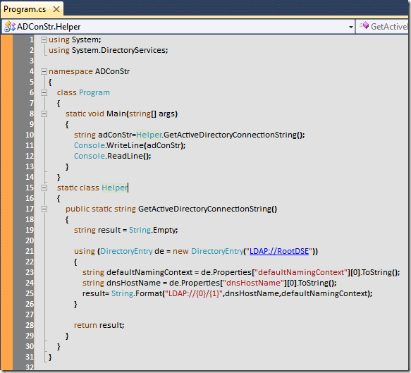

# Tek Fotoluk İpucu-43(Active Directory Connection String Bilgisini Almak)
Merhaba Arkadaşlar,

Oldu da domain üzerinde çalışırken Active Directory'nin bağlantı bilgisine ihtiyaç duydunuz? Bu özellikle AD ile.Net tarafında çalışırken size gerekli olan önemli bir bilgidir. Nasıl mı elde edebiliriz? Aslında basit bir teknik var. Garantisi yok ama en azından ben şirket makinemde başarılı bir şekilde test edebildiğimi söyleyebilirim

[ADConStr.rar (23,80 kb)](assets/ADConStr.rar)
