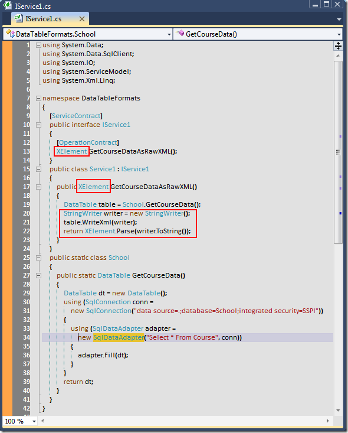

# Tek Fotoluk İpucu–12 (DataTable için Raw XML Formatı)
Merhaba Arkadaşlar,

Peki elinizde bir DataTable var ve siz bunun Raw XML formatındaki çıktısını istemcilere vermek istiyorsunuz. Ne yaparsınız?

Not: WcfTestClient istemcisine güvenmeyin. XElement tipinin geriye döndürelemeyeceğini söyleyerek örneği test etmenize izin vermez. Bu sizi yanıtlmasın. 

[DataTableFormats.rar (18,32 kb)](assets/DataTableFormats.rar)
