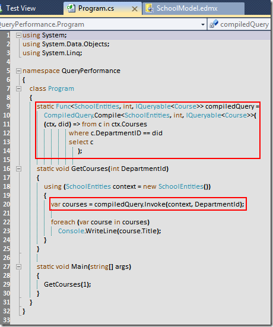

# Tek Fotoluk İpucu–14 (Compiled Query)
Merhaba Arkadaşlar,

Entity Framework ile Compiled Query'ler hazırlayabileceğinizi ve daha performanslı sorgulamalar yaptırabileceğinizi biliyor muydunuz? İşte basit bir örnek

[QueryPerformance.rar (75,31 kb)](assets/QueryPerformance.rar)
