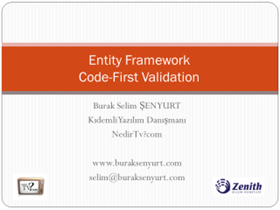

# Entity Framework Code First için Doğrulama(Validation) Stratejileri Webiner(Webcast) Kayıtları
 Merhaba Arkadaşlar,

Geçtiğimiz günlerde [Nedirtv?com](http://www.nedirtv.com) topluluğu adına Entity Framework Code First modeli için kullanılabilen doğrulama (Validation) stratejilerini incelediğimiz bir Webiner (Webcast) gerçekleştirdik.

Katılımcılara ve özellikle ekran kayıtlarını alıp bizlerle paylaşan Bahtiyar Dilek arkadaşımıza çok çok teşekkür ediyorum.

Bu webinerimizde nitelik (attribute), arayüz (interface) ve metod ezme (override) gibi enstrümanlar yardımıyla, doğrulama işlemlerini çeşitli seviyelerde nasıl gerçekleştirebileceğimizi incelemeye çalıştık. Ayrıca özel doğrulama niteliklerinin (Custom Validation Attribute) nasıl yazılabileceğine de değindik.

Yaklaşık olarak 1saat süren webinerimizi [Nedirtv?com üzerinden izleyebilir ve indirebilirsiniz](http://nedirtv.com/video/entity-framework-code-first-validation). Ayrıca webinere ilişkin [konu anlatımı ve örnekleri içeren makaleye de bu adresten ulaşabilirsiniz](https://www.buraksenyurt.com/post/Entity-Framework-Code-First-icin-Dogrulama(Validation)-Stratejileri.aspx).

[Youtube Link](https://www.youtube.com/watch?v=X5Dy8Ap81AU)

Önümüzdeki ay gerçekleştirmeyi planladığımız yeni bir Webinerde görüşmek dileğiyle hepinize mutlu günler dilerim

