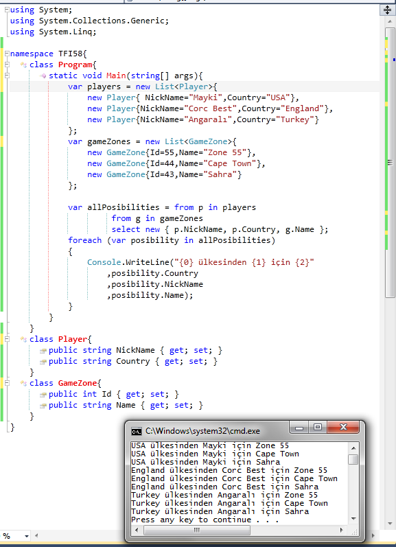

# Tek Fotoluk ipucu - 57 LINQ Tarafında Cross Join
Merhaba Arkadaşlar,

Elinizde iki adet nesne koleksiyonu olduğunu ve bunların veri satırı bazındaki olası eşleşmelerine ait kartezyen tablosunu elde etmek istediğinizi düşünün. Aşağıdaki gibi bir sorgu, SQL tarafındaki Cross Join etkisini LINQ ile de gerçekleştirebileceğimizi göstermektedir. Buna göre hangi ülkeden kimin hangi oyun alanlarında yer alabileceğine dair bir kartezyen çarpım içeriği elde etmiş oluruz

Görüşmek dileğiyle

