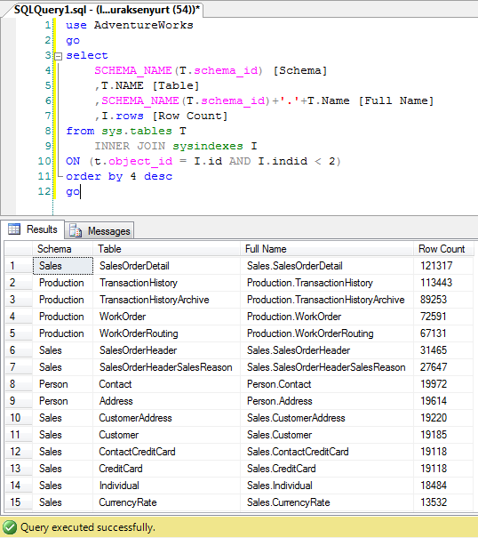

# Tek Fotoluk İpucu 45 - Schema Adı ile birlikte Tablo Satır Sayılarını Elde Etmek
Merhaba Arkadaşlar,

SQL tarafındaki sistemsel nesneleri göz önüne aldığımızda inanılma faydalı ve bilgilendirici sorgular yazabildiğimizi eminim ki hepiniz biliyorsunuzdur. Söz gelimi bir veritabanı içerisinde yer alan tablo adlarını, şema adları ile birlikte ve güncel satır sayılarını da içerek şekilde elde etmek istediğinizi düşünelim. Ne yaparsınız

