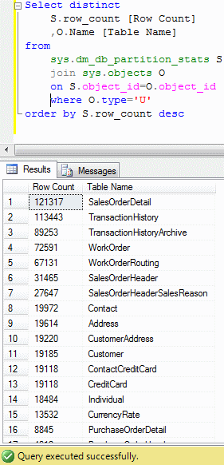

# Tek Fotoluk İpucu 49–Daha Hızlı Count
Merhaba Arkadaşlar,

Çok yüksek rakamlarda satır içeren (Milonylarca Satır) tablolar söz konusu olduğunda, bunların satır sayılarını, Count Aggregate fonksiyonu ile bulurken süre kaybı yaşıyorsak ve sonuçları geç alıyorsak daha hızlı bir yola başvurabiliriz. Nasıl mı?

