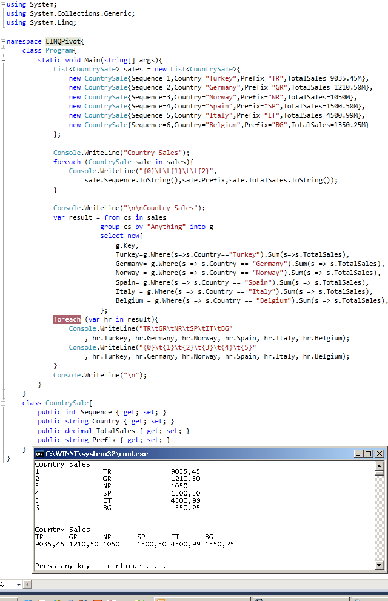

# Tek Fotoluk İpucu 50 - Pivot Taklidi Yapan LINQ
Merhaba Arkadaşlar,

Elimizde ülke bazlı bir toplam satış rakamlarını içeren bir veri listesi olduğunu düşünelim. Normal şartlarda bu tip bir çıktıyı sorguladığımızda veri içeriği ülke bazlı olacak şekilde dikine akacaktır. Ancak istediğimiz çıktı, ükle bazlı satışların toplam tutarlarını yatay eksene taşıyabilmek. Bir nevi SQL tarafındaki PIVOT hareketini gerçekleştirmek istiyoruz. Bunu bir LINQ sorgusu ile yapmaya ne dersiniz? Burdan buyrun

